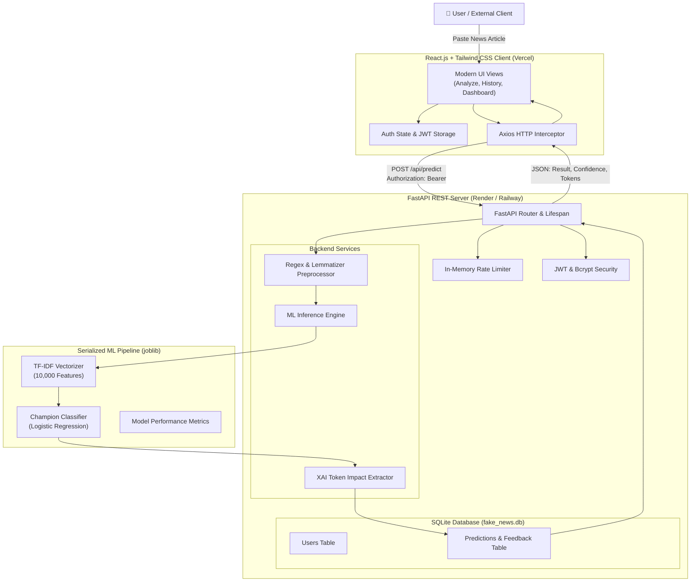
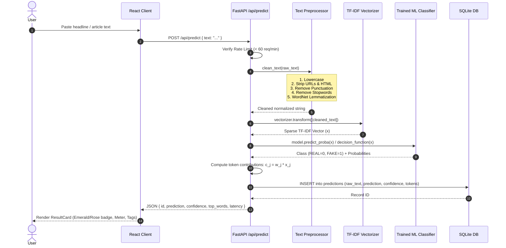
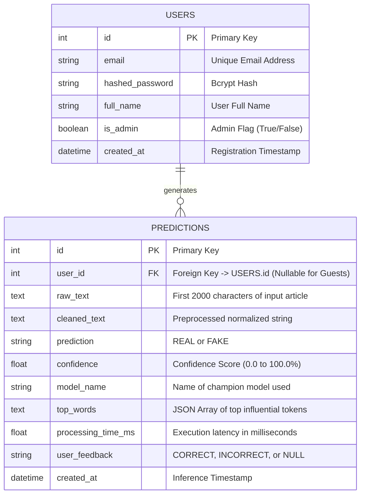

# System Architecture & Diagrams

## 1. High-Level System Architecture Diagram

```mermaid
graph TD
    User["👤 User / External Client"]
    
    subgraph Frontend ["React.js + Tailwind CSS Client (Vercel)"]
        UI["Modern UI Views\n(Analyze, History, Dashboard)"]
        AuthContext["Auth State & JWT Storage"]
        AxiosClient["Axios HTTP Interceptor"]
    end
    
    subgraph Backend ["FastAPI REST Server (Render / Railway)"]
        Main["FastAPI Router & Lifespan"]
        RateLimiter["In-Memory Rate Limiter"]
        Security["JWT & Bcrypt Security"]
        
        subgraph Services ["Backend Services"]
            Cleaner["Regex & Lemmatizer Preprocessor"]
            MLService["ML Inference Engine"]
            Explainability["XAI Token Impact Extractor"]
        end
        
        subgraph Database ["SQLite Database (fake_news.db)"]
            UsersTable["Users Table"]
            PredictionsTable["Predictions & Feedback Table"]
        end
    end
    
    subgraph MLArtifacts ["Serialized ML Pipeline (joblib)"]
        TFIDF["TF-IDF Vectorizer\n(10,000 Features)"]
        BestModel["Champion Classifier\n(Logistic Regression)"]
        MetricsJSON["Model Performance Metrics"]
    end

    User -->|Paste News Article| UI
    UI --> AuthContext
    UI --> AxiosClient
    AxiosClient -->|POST /api/predict\nAuthorization: Bearer <JWT>| Main
    Main --> RateLimiter
    Main --> Security
    Main --> Cleaner
    Cleaner --> MLService
    MLService --> TFIDF
    TFIDF --> BestModel
    BestModel --> Explainability
    Explainability --> PredictionsTable
    PredictionsTable --> Main
    Main -->|JSON: Result, Confidence, Tokens| AxiosClient
    AxiosClient --> UI
```

---

## 2. Natural Language Processing (NLP) Pipeline Flow

```mermaid
sequenceDiagram
    autonumber
    actor User
    participant Frontend as React Client
    participant API as FastAPI /api/predict
    participant Preprocessor as Text Preprocessor
    participant Vectorizer as TF-IDF Vectorizer
    participant Model as Trained ML Classifier
    participant DB as SQLite DB

    User->>Frontend: Paste headline / article text
    Frontend->>API: POST /api/predict { text: "..." }
    API->>API: Verify Rate Limit (< 60 req/min)
    API->>Preprocessor: clean_text(raw_text)
    Note over Preprocessor: 1. Lowercase<br/>2. Strip URLs & HTML<br/>3. Remove Punctuation<br/>4. Remove Stopwords<br/>5. WordNet Lemmatization
    Preprocessor-->>API: Cleaned normalized string
    API->>Vectorizer: vectorizer.transform([cleaned_text])
    Vectorizer-->>API: Sparse TF-IDF Vector (x)
    API->>Model: model.predict_proba(x) / decision_function(x)
    Model-->>API: Class (REAL=0, FAKE=1) + Probabilities
    API->>API: Compute token contributions: c_j = w_j * x_j
    API->>DB: INSERT into predictions (raw_text, prediction, confidence, tokens)
    DB-->>API: Record ID #
    API-->>Frontend: JSON { id, prediction, confidence, top_words, latency }
    Frontend-->>User: Render ResultCard (Emerald/Rose badge, Meter, Tags)
```

---

## 3. Database Entity-Relationship (ER) Diagram

```mermaid
erDiagram
    USERS ||--o{ PREDICTIONS : "generates"
    
    USERS {
        int id PK "Primary Key"
        string email "Unique Email Address"
        string hashed_password "Bcrypt Hash"
        string full_name "User Full Name"
        boolean is_admin "Admin Flag (True/False)"
        datetime created_at "Registration Timestamp"
    }

    PREDICTIONS {
        int id PK "Primary Key"
        int user_id FK "Foreign Key -> USERS.id (Nullable for Guests)"
        text raw_text "First 2000 characters of input article"
        text cleaned_text "Preprocessed normalized string"
        string prediction "REAL or FAKE"
        float confidence "Confidence Score (0.0 to 100.0%)"
        string model_name "Name of champion model used"
        text top_words "JSON Array of top influential tokens"
        float processing_time_ms "Execution latency in milliseconds"
        string user_feedback "CORRECT, INCORRECT, or NULL"
        datetime created_at "Inference Timestamp"
    }
```
